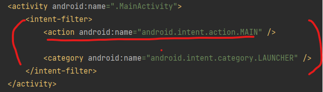

# Activity

[App Component](../App%20Components/README.md)

## Basic
- Crucial component
- System initiates code in `Activity` instance by calling callback methods corresponding stages of its lifecycle


## Concept of Activities
- `User starting an app can be dynamic`
    - Simply opens an app or have other apps open others
    - `Activity` is designed to facilitate this paradigm

    
- Provides a window which app draws its UI
    - Takes full screen or smaller than full screen


- App can have multiple activities - one screen for each

- An activity can start other activities
    - Activities work together, but loosely bound
    - Not often do that when developing
    - This usually happens when calling activities in other apps
        - Opening social media app when using `Sharing`
    
- To use activity, you must configure it in Manifest.xml
    - `<actvity> tags, with name, icons, labels, theme..`

    
## Create new project and open manifest file!


- We can also set `intent-filter`
    - Job of `intent-filter`
        - `Provide an ability to launch an activity based on both explicit and implicit request`
        - `Start the Send Email activity in Gmail app` :point_right: Explicit request
        - `Start the Send Email screen in any activity that can do the job` :point_right: Impicit request
    - When Clicking `Share` and system shows apps can perform `Share` task, That's an intent filter at work

- We can set this in manifest
    ```xml
    <activity android:name=".ExampleActivity">
        <intent-filter>
            <action android:name="android.intent.action.SEND" />
            <category android:name="android.intent.category.DEFAULT" />
            <data android:mimeType="text/plain" />
        </intent-filter>
    </activity>
    ```
    - Includes `<action>`, optionally `<category>` and `<data>`
    - These tags specify the type of intent your activity can respond

- We can also specify which apps can start a particular activity
    - Parent activity cannot launch child activity unless they have same permissions


# Lifecycle of Activity


- Activity goes through various stages of lifecycle over its lifetime
1. onCreate()
    - `Called when system creates an activity`
    - `Must be implemented`
    - `Should initialize the essential components` : create views, bind data...
    - Must call `setContentView()` to define which layout should activity shows to users
    - Not visible to user
2. onStart()
    - Called after `onCreate` and `onRestart()` 
    - `Where activity becomes visible`
    
3. onResume()
    - `Called just before the activity starts interacting with the user`
    - `The activity is at the top of the activity stack, captures all user input`
   
4. onPause()
    - `When activity loses focus (partially visible)`, technically...
        - **Is an indication that the user is leaving the activity and the activity will soon enter the Stopped or Resumed state**      
    - `May continue to update UI if users is expecting` : Music App, Navigation Screen
    - `Should not use it to save application or user data, to make network calls, database transactions` 
    - next: onResume, onStop
    
5. onStop()
    - No longer visible to the user
    - When user tabs home button
    - onRestart() or onDestroy()
   
6. onRestart()
    - Called when stopped state is about to restart
    - Restores the state from the time it was stopped
   
7. onDestroy()
    - Called before an activity is destroyed
    - Final callback that activity receives
    - Implemented to ensure all resources released

# Links
[Introduction to Activities](https://developer.android.com/guide/components/activities/intro-activities)
[Intents and Intent Filters](https://developer.android.com/guide/components/intents-filters)


# Next(WIP)
https://developer.android.com/guide/components/activities/activity-lifecycle