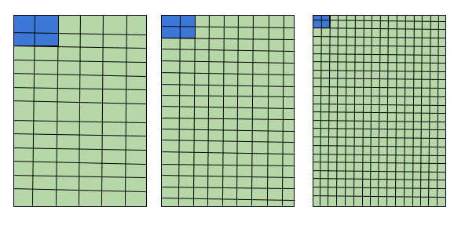
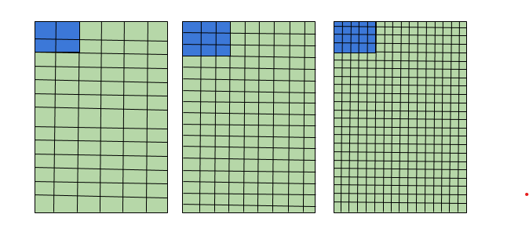

# dp, sp, pt px, mm, in
- Supported by Android

## Terminology

1. `dp`
    - Density-independent Pixels
    - Relative to 160dpi(dots per inch)
      - `Equal to one physical pixel on screen with density of 160`
    - `When running on a higher density, number of pixels used to draw 1dp is scaled up`
    - `When running on a lower density, number of pixels used for 1dp is scaled down`
    - Calculation of pixel to dp
      - `px = dp * (dpi / 160)`
2. `sp`
    - Scale-independent Pixels
    - `By default, it is Adjusted by user's font size preference, and screen density`
    - Same as `dp`, but it also reflects user font size settings
    - Used to for size of text
3. `pt`
    - Points
    - 1/72 of an inch based on physical size of the screen,
4. `px`(not recommended)
    - Pixels
    - The Smallest unit of graphical display or image
    - Correspond to actual pixels on the screen
    - Not recommended to use since different devices may have different number of pixels per inch, or
    - May have fewer total pixels available on the screen
5. `mm`(not recommended)
    - Millimeters
    - Based on the physical size of the screen
6. `in`(not recommended)
    - Inches
    - Based on physical size of the screen

7. Screen Resolution
    - Often refer to as x * y form
    - x: number of pixels in horizontal direction
    - y: number of pixels in vertical direction

8. Pixels per inch
    - A measurement of pixel density(resolution)
    - If you have an image 100 * 100 pixel to print 1-inch square -> resolution of 100 pixels per inch

9. DPI
   - Number of printed dots within one inch of an image printed by a computer

### Why does Android not use Pixels when setting view size?
- Imagine number of devices with same size, but with different screen resolution
- When We set out button that takes 2 pixels on both width and height

   

- The higher the density(resolution) is, the smaller button size will be
- `A: The reason Android does not use or recommend pixel in setting size of views is because setting size in pixels
will result in different sizes for different devices!!!`

### Solution to replacing pixel in setting size?
- Using `dp`
- By using `dp` in height and width, Android keeps size of views across different devices
  
  

- What Android has done here is to map the number of pixels

# Link
[Dimension](https://developer.android.com/guide/topics/resources/more-resources#Dimension)

[How do computers store images](https://www.youtube.com/watch?v=EXZWHumclx0)

[Images, Pixels and RGB](https://www.youtube.com/watch?v=15aqFQQVBWU)

[How Computer Work: Binary & Data](https://www.youtube.com/watch?v=USCBCmwMCDA)

[Support Different Pixel Densities](https://developer.android.com/training/multiscreen/screendensities)

[Understanding Density Independence Pixel: sp, dp, dip and all in android](https://blog.mindorks.com/understanding-density-independent-pixel-sp-dp-dip-in-android)

[What is the difference between “px”, “dip”, “dp” and “sp”?](https://stackoverflow.com/questions/2025282/what-is-the-difference-between-px-dip-dp-and-sp)