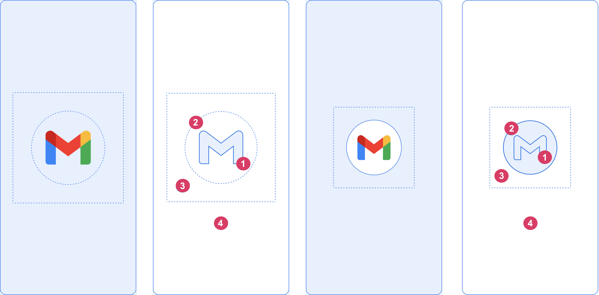

# Splash Screen

1. [What is Splash Screen](#What-is-Splash-Screen)
2. [Why using Splash Screen](#Why-using-Splash-Screen)
3. [Implementation](#Implementation)
4. [How it works](#How-it-works)
5. [Components of Splash Screen](#Components-of-Splash-Screen)
6. [Dimension](#Dimension)
7. [Animation and its launch sequence](#Animation-and-its-launch-sequence)
---

# What is Splash Screen
- **First Screen** user meets when launching an app
- Contains app icon, animation

# Why using Splash Screen
- Deliver positive first impression
- Unique branding purpose(either your app, or Company)

# Implementation

# How it works
- App displays splash screen on following condition:
    - **Cold Start**: App starting from scratch 
    - **Warm Start**: Activity has not been created, or re-launch
- And?
    - System shows splash screen based on theme and any configs(i.e., animation) you have defined
    - When the App is ready, Splash Screen is dismissed, and the App is displayed
    
# Components of Splash Screen

- Components are defined in **AndroidManifest.xml**
- Some components can be customizable
    - App Icon, icon background and window background
- **App Icon(1)**
    - Should be a vector drawable
    - Static or animated(best to not exceed 1000 ms) vector
    - Launcher Icon is used by default
    
- **Icon Background(2)**
    - Optional
    - Use it if you want more contrast between icon, and the window background
    - When using *Adaptive Icon*, **Background is displayed if there is enough contrast with window background**
        - 1/3 of the foreground is masked
- **Window Background(3)**
    - Single opaque color
    - if window background is set and is a plain color, it is used by default, if not set
    
# Dimension
- Branded Image: 200 X 80dp
- App Icon with background: 240 X 240dp, fit within a circle of 160dp in diameter
- App icon w/o background: 288 X 288dp, fit within a circle of 192dp in diameter
- If specification is not met, anything outside a circle will be masked

# Animation and its launch sequence
- Animated is embedded within the following launch sequences:
    1. Enter Animation
       - Not customizable since it is controlled by the system
    2. Splash Screen
       - **Customizable: can add own logo...but has some requirements**
    3. Exit Animation
        - Hide splash screen
        - Customizable if you want to control it manually 
            - Need access to Splash Screen View

- **App launch can skip animation** if the app is ready earlier
    - App triggers `onResume()`, or `Splash screen times out automatically`
    - `Splash screen should only be dismissed with onResume()`

- Requirements
    - Single window background color with no transparency
    - Animation
        - Animated Vector Drawable(AVD) format
        - AVD should be four times the size of an adaptive icon
        - Not exceeding 1000ms on phones
    
# FYI
- User perceived startup time is less with animated splash screen

### Links

1. [Splash Screen, from Android Docs](https://developer.android.com/guide/topics/ui/splash-screen)
2. [Splash Screen, from Material Design](https://material.io/design/communication/launch-screen.html#usage)
3. [What is a splash screen](https://bootcamp.uxdesign.cc/what-is-a-splash-screen-2980602f83f8)