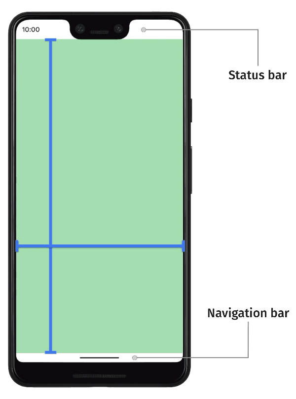
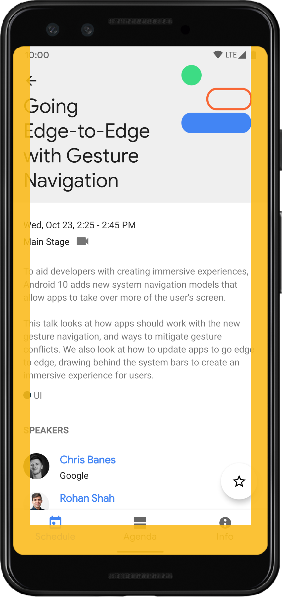
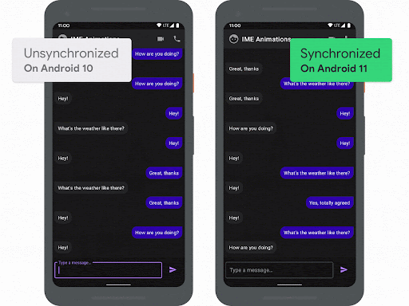

# Window Insets

## Default behavior of an app

- laid out below status bar and above navigation bar
- status bar + navigation bar = system bars

> However, app can also be configured to display content in system bars



## What is Window Insets?

- overlaps between system bars and app UI
    - `represent the parts of your screen where your app can intersect with system UI`
- Simple, more than just overlaps
    - tells your app about system gestures as well

## Types of window insets

- App can expand its window to entire screen and `draw edge-to-edge behind system bars`
- App can `temporarily hide system bars` for more immersive experience
- Display cutouts
- software keyboard

## Common example of window insets

- keyboard transition

# Display edge-to-edge

- draw your app, or display content of your app `behind system bars(status bar + navigation bar)`

## How to implement

- lay out app full-screen
  ```kotlin
  // If set to false, the framework will not fit the content view to the insets 
  // and will just pass through the WindowInsetsCompat to the content view.
  WindowCompat.setDecorFitsSystemWindows(window, false)
  ```
- Change system bar colors and transparency
    - to make content behind system bars visible
    - System handles all visual protection of UI after changing color
        1. Gesture Navigation Mode
            - System applies dynamic color adaptation
            - `Contents of the system bars change color based on the content behind them`
        2. Button Modes
            - translucent scrim behind the system bars, or a transparent system bar
        3. Status bar content color
            - Control the color of status bar content(icons)

- Handle any visual overlaps
    - Now app can be drawn behind system bars
    - How are we going to react to insets?
        - system bar insets
            - system UI is displayed in the z-axix above the app
        - system gesture insets
            - yellow area where system gestures take priority over the app
              
                - bottom sheets, view pagers are common use case

# Immersive Mode

- real full screen without system bars
- Netflix, game, books
- can set which system bars to hide, behaviors to show hidden system bars
  [Implementation example](https://developer.android.com/training/system-ui/immersive)

# Support display cutouts


- cutouts is an area where device extends its surface to store some important sensors

## How to support display cutouts?

1. Choose how your app will handle cutouts
    - `LAYOUT_IN_DISPLAY_CUTOUT_MODE_DEFAULT`
        - content renders into the cutout area in portrait mode, letterboxed in landscape mode
    - `LAYOUT_IN_DISPLAY_CUTOUT_MODE_SHORT_EDGES`
        - content renders into the cutout area in both portrait and landscape mode
    - `LAYOUT_IN_DISPLAY_CUTOUT_MODE_NEVER`
        - never renders into the cutout area
    - in theme.xml
    ```xml
    <style name="ActivityTheme">
      <item name="android:windowLayoutInDisplayCutoutMode">
        shortEdges <!-- default, shortEdges, or never -->
      </item>
    </style>
    ```

[check out images of these 3 modes](https://developer.android.com/guide/topics/display-cutout)

# Control software keyboard

- Using `WindowInsetsCompat`, app can query and control the on-screen keyboard, just like system bars
- can also use animation to provide seamless transition when opened or closed



